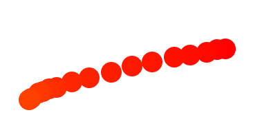
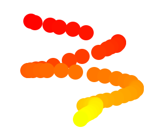

#  Fun with HTML5 Canvas  #

##  **實現目標**  ##

操作canvas的路徑繪製實現滑鼠繪圖功能。

##  **canvas**     ##

**相關屬性**

- getContext()
- strokeStyle
- lineCap
- lineJoin

**路徑繪製**

- beginPath()
- moveTo()
- lineTo()

**鼠標事件**

- mousedown
- mousemove
- mouseup
- mouseleave

# 過程中我遇到的困難 #

----------
為了可以實現滑鼠繪圖功能，一開始時我嘗試了三種moveTo()到達lineTo()的線段寫法來進行比較。

其中一種是將路徑起點與路徑終點都設為同一點座標:

    context.lineCap = 'round';//線帽為圓形
    context.moveTo(e2.offsetX, e2.offsetY);//滑鼠座標作為路徑起點
    context.lineTo(e2.offsetX, e2.offsetY);//滑鼠座標作為路徑終點
    context.stroke();//繪製線條

可是在滑鼠拖曳速度加快的情況下我繪製出來的線條會產生斷點:

為了找出發生斷點的原因，我想知道:

- mousemove怎麼被觸發的

我知道當使用者用滑鼠在canvas畫布上移動時mousemove就會被連續觸發，但是它是以什麼頻率被觸發一次呢?

在w3c上查到的如下

> Each time a user moves the mouse one pixel, a mousemove event occurs

只要在座標上一移動1pixel,事件就會被觸發一次。

可是經過自己實作的結果，應該說1pixel是觸發mousemove繪製的最小單位吧。

下圖的mousemove被觸發了63次，表示只繪製了63次，斷掉的地方是滑鼠畫過且沒觸發mousemove繪製的地方，而event沒觸發的原因自己猜測是因為速度快所以瀏覽器還是js物件沒辦法抓到我滑鼠座標然後放進內存裡。
因此在這裡知道了斷點產生的原因:其一是event沒有被觸發，而其二是我把路徑起點與終點的座標重疊繪製。

  

